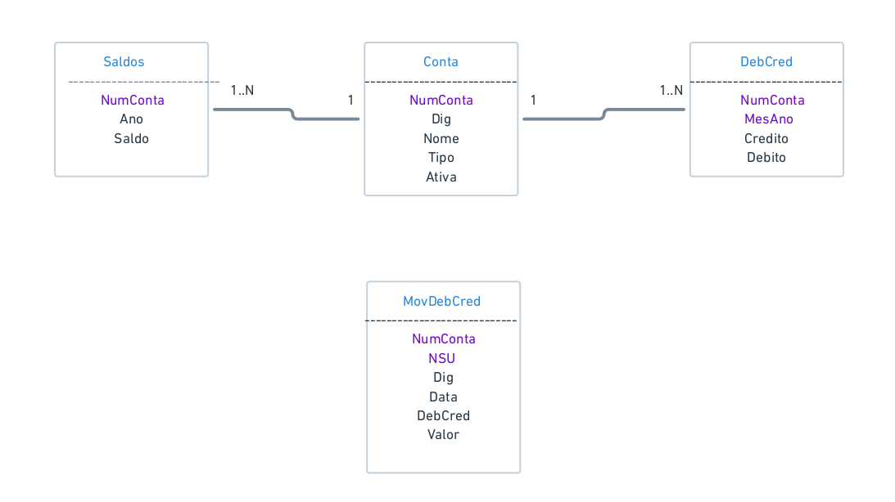
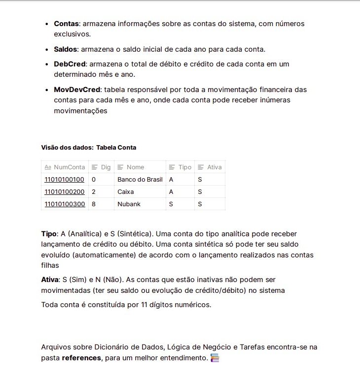

# Sistema de Contabilidade - SICON

Implementação de rotinas automáticas de processamento em banco de dados utilizando stored procedures, cursores, triggers, visões e suporte transacional para garantia de atomicidade.

<h1 align="center">
  
  
</h1>
